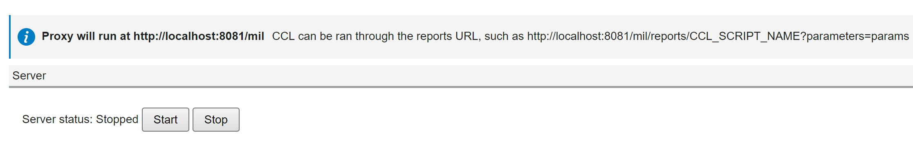
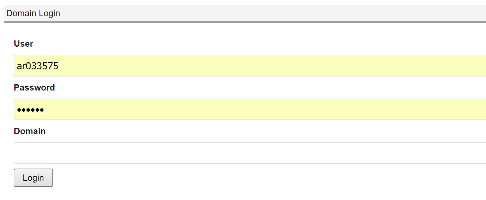

# Gaia Millennium Proxy Plugin

**Note:** You do not need to configure this plugin if you use the Gaia Live Development plugin.

The Millennium Proxy plugin is a web proxy that allows you to issue
requests to Cerner Millennium through HTTP. This plugin displays the
server status and allows you to enter the domain credentials.

Complete the following steps to use the Millennium Proxy plugin:

1.  Click `Start` to start the server, or click `Stop` to stop the
    server.

    

2.  With the server running, enter your username, password, and domain.

    

3.  Click `Login` to log into the domain.
