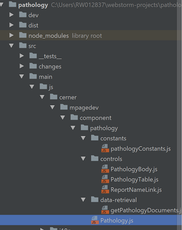

# Configuration
Whats-up-doc needs to know where your javascript source code files reside.  This is done through a single command performed at the command prompt.
## Command Line

### Source Files

In a `cmd` prompt run the following command to set the file path of your js files:

Syntax:
```
npm run gaia whats-up-doc:config files="<file path>"
```
*Note: Wildcards are accepted as well as [Globstar](http://www.linuxjournal.com/content/globstar-new-bash-globbing-option).*

#### Example
Running the command below will cover all files with a js extension under the src directory.



```
npm run gaia whats-up-doc:config files="src/**/*.js"
```

### Export API
In a cmd prompt run the following command to allow whats-up-doc to export the markdown to a file.  This is very useful to share artifact API's with the user community.  This way it is easy to document to an artifacts GitHub repo.
```
npm run gaia whats-up-doc:config markdownOutputLocation="<file path>"
```
#### Example
Running the command below will allow whats-up-doc to export the JSDoc markdown to the "PathologyAPI.md" file in the root of the Pathology project.
```
npm run gaia whats-up-doc:config markdownOutputLocation="PathologyAPI.md"
```

#### NOTE
* This configuration is optional

### Automatically generate and update documentation on commit
Install [husky](https://www.npmjs.com/package/husky), which allows you to add git hook configuration to
the `package.json` scripts section.

```bash
npm install --save-dev husky
```

Ensure that the plugin has been configured with source file locations and output file locations. See [Source Files](#source-files) and [Export API](#export-api).

Add the following scripts to `package.json`
```json
{
    "docs": "gaia whats-up-doc:toFile",
    "precommit": "npm run docs && git add docs/api.md"
}
```

Your markdown documentation will now be automatically updated on commit when you update your jsdoc.
