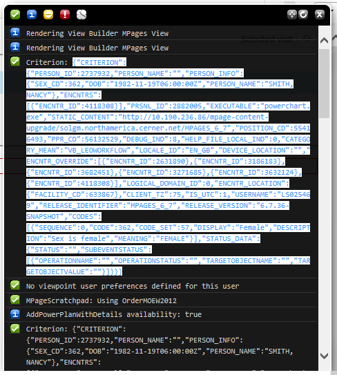
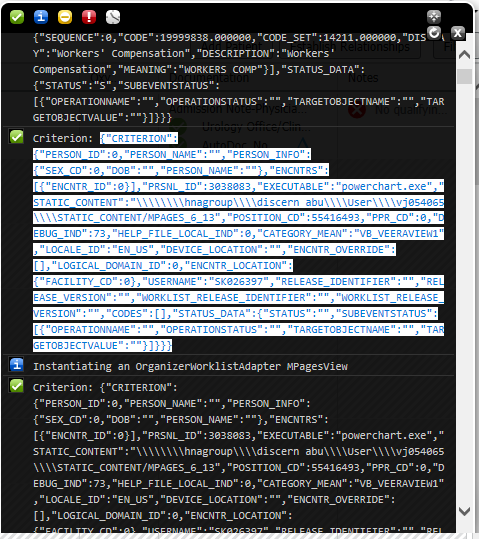
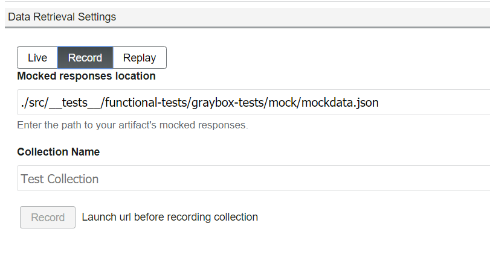
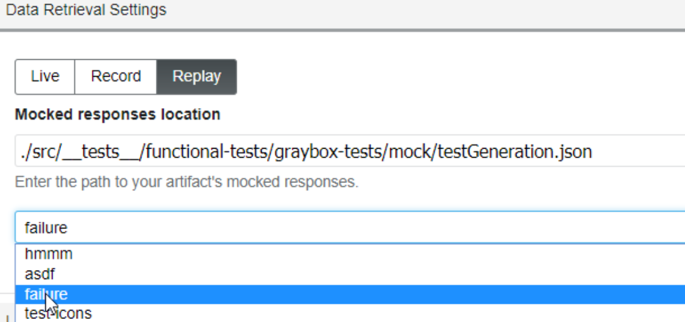

# Gaia Live Dev Plugin

The live dev plugin allows logging into a domain and launching an MPage running custom code with minimum effort. It does this by automatically configuring the Millennium Proxy, Content Server, and Webpack plugins behind the scenes.

## Driver Config

This section has the configuration necessary to tell millennium how to launch an MPage.

### Static Content Location

The path to the root directory of a local copy of a static content. The static content is the code provided by MPages. It is usually located on a domain's code warehouse, and is shipped on a package. This path can be either relative or absolute.
**Note: It may be necessary to build a copy of static content that doesn't include the artifact you are working on to ensure changes to the artifact are pulled in and aren't overwritten by the current version of the artifact.**

### CCL Program

The name of the CCL program responsible for launching an MPage. This is the CCL script that will be ran to get the MPage. It may vary depending on what MPage you want to access. For viewbuilder MPages, it is usually `mp_unified_driver`. For Organizer Views, the CCL program is `mp_unified_org_driver`

### Program Parameters

The parameters to be passed to the CCL program when launched. This is a comma separated list of parameters. String parameters can be delimited with the usual CCL string delimiters (^, ~, ', ").

#### Param Parser Button

This button will automatically fill the _program parameters_ box with parameters compatible to be ran with the `mp_unified_driver` MPage or `mp_unified_org_driver` Organizer MPage View.

For that to work, you need to open the MPage on powerchart. Then there are two ways to generate the parameters from there:

-   Unified Driver source code

If you have access to "Right Click" > "View Source" on powerchart, you can copy the entire MPage source code and paste on the _Unified Driver_ section of the _param parser_. Click _Generate_ and the parameters will be put in the _program parameters_ box.

-   Unified Driver Criterion JSON

If you don't have access to right clicking - common in some Citrix installations -, you can copy the criterion JSON from blackbird instead. Open blackbird and copy the criterion string



and paste it on the _Criterion JSON (Unified Driver)_ section of the _param parser_. Click _Generate_ and the parameters will be put in the _program parameters_ box.

-   Unified Org Driver source code

If you have access to "Right Click" > "View Source" on powerchart, you can copy the entire Organizer MPage source code and paste on the _Unified Org Driver_ section of the _param parser_. Click _Generate_ and the parameters will be put in the _program parameters_ box.

-   Unified Org Driver Criterion JSON

If you don't have access to right clicking - common in some Citrix installations -, you can copy the criterion JSON from blackbird instead. Open blackbird and copy the criterion string



and paste it on the _Criterion JSON (Unified Org Driver)_ section of the _param parser_. Click _Generate_ and the parameters will be put in the _program parameters_ box.

### Web Service URL

If you need to use an MPages Web Service other than the built in Millennium Proxy, fill this box with the URL of the service. The URL should be everything leading up to the "reports" section. If your webservice URL is something like:

`http://mydomain.com/discern/reports/mp_unified_driver?PARAMS...`

then you will fill this box with:

`http://mydomain.com/discern`

## Artifact Config

The artifact config section controls where to find the source code to be inserted into the MPage. It can either use the existing webpack plugin configuration, or use a hardcoded path for both the source and CSS location

### i18n Location

Using the provided textbox enter the full or relative path of the artifacts static internationalized locale.js file.

### Enable Webpack checkbox

Check this box if your artifact is configured to use the Gaia _webpack plugin_ to build itself. Once checked, it will automatically ensure the webpack server is running prior to launch the MPage, and will automatically include the generated webpack bundle.

### Enable Auto-Refresh checkbox

When checked, every time webpack recompiles the code, the page will auto refresh. This will only work if the _Enable webpack_ box is also checked.

### Webpack Target

The webpack target to be ran to generate the webpack bundle. If the _enable webpack_ box is checked and there are more than one webpack targets, this will become a dropdown. The correct webpack target can then be selected.

### Source code location

Full or relative path to the source code to be injected into the MPage. This is only used if you are not using webpack to build your artifact.

### CSS Location

Full of relative path of a CSS file to be injected into the MPage. This is only used if you are not using webpack to build your artifact.

## Record/Replay

Data retrieval can be updated to utilize mock responses so that development and testing can be performed without a live connection to millenium. The location of the mock files utilized for this can be specified in the mockResponseLocation setting in the gaia.json file, which may also be configured from the Record tab itself. To facilitate in generating mock data to test against; the record tab allows all CCL requests made to be recorded and saved to the specified file location. This allows each request to be later replayed for testing.



In order to record data, select the Record tab in the Data Retrieval section. All requests and responses made after the point of reaching this tab will be recorded. To save the requests to file, first launch url by clicking the launch button from the launch pad and enter the file location where the mock data JSON will be created and mock data will be stored in, or use the existing location if previously configured. After completing the workflow that you desire to replay,enter the collection name and click the Record button to save the current test collection.



After saving, you can navigate to the file to modify any requests and responses as you see fit. The following JSON structure describes how requests are collected.

```
{
    scriptName: String,
    parameters: String,
    response: String,
    latency: Number
}
```

After recording data, the replay section can be selected to select a test collection to utilize in replaying data. If a matching request is found in the test collection, then the corresponding response will be replayed. If no match is found, then an attempt will be made to pass through the request to millenium.

## Launch Pad

This section configures and launches the MPage proper.

### Launch URL dropdown

This is the exact URL that will be fired when the _Launch_ button is clicked. It is automatically generated from the configurations listed above.

### Save Configuration button

Applies all the configuration above to the respective plugins, and updates the gaia.json file.

### Launch button

Will have the same effect as clicking _Save Configuration_, followed by a login window request millennium credentials. Once credentials are provided, the system will launch the MPage with all the configurations above. If the page does not open, check your pop-up blocking settings in your browser.

## Settings

The injector plugin will create and maintain a JSON object with the structure below.

```
{
    cclProgram: String,
    cssLocation: String,
    isWebpackAutoRefreshEnabled: Boolean
    isWebpackEnabled: Boolean,
    mockResponseLocation: String,
    mockResponseCollection: String,
    programParams: String,
    sourceCodeLocation: String,
}
```

## Steps to setup mock data for a component using the Live Dev plugin

We will setup a mock data view for a WorkList column in this tutorial to demonstrate the setup steps.

Step 1. Configure the content server to point to the static content and setup a worklist column view using the injector and
Dev plugin as outlined in [this tutorial](https://github.cerner.com/MPagesFusionWorklists/worklist-documentation/blob/master/docs/Gaia/Setting%20up%20Injector%20and%20LiveDev.md).

Step 2. Record mock response using the record functionality in the Live Dev plugin. Enter the path where the response will be stored as a JSON file and enter a name for the mock response. Refresh the view and hit Save Collection. Refer to the [Record section](https://github.cerner.com/MPagesEcosystem/gaia-plugin-livedev/tree/mock_data_setup#recordreplay) above for configuration details.

Step 3. Each recorded mock response should have been stored as a array element in the JSON file and should be available in the drop down in the Replay tab. Once a mock response is selected launch view with mock response using the Launch URL button.


## Issues and Workarounds

* _Injector does not save the prefix or does not apply it correctly_.
Solution: This is a known [issue](https://github.cerner.com/MPagesEcosystem/gaia-plugin-injector/issues/21), when injecting JS, CSS and i18n please use the full path instead of relying on the prefix to construct the full path. Ex : http://localhost:9001/api/routes/contentserver/content/visits-column/dist/js/VisitColumn.js

* _Launch URL button does not open a new tab_.
Solution: Make sure the domain being logged into is correct and wait for at least 10 seconds for it to launch. Sometimes the Launch URL button needs to be clicked twice for it to launch the new view.

* _In the Record tab, when I hit Save collection it created an empty mock response JSON with no data even though my view has data in it._
Solution: Make sure to launch url from the launch pad right after clicking on the Records tab before attempting to record a collection for replay.

* _In the replay tab the options for mock response is empty._
Solution: Make sure to check the mock response JSON file. The response may not have been recorded and it maybe empty. Try recording it again.

* _I have a Worklist view with multiple view setup, Only one column displays data in the mock response view and I get an error banner at the top_
Solution: This is a known [issue](https://github.cerner.com/MPagesEcosystem/gaia-plugin-injector/issues/16), currently with worklist columns, the interceptor intercepts data for only a single column and the response is stored for only that column.

* _The changes to my artifact aren't showing up!_
Solution: the static content may need to be built without the artifact you are testing to ensure the artifact is not overwritten by the existing version. Since live dev loads the static content and then dynamically loads the artifact being tested, it is possible for them to be loaded in the wrong order. If this happens, the dynamically loaded version of the artifact can get overwritten by the version in the assembly. It is best to not include the artifact in the assembly.

Please file any other issues you may encounter or enhancements you think would be a good addition to either the injector or live dev Git repo.


