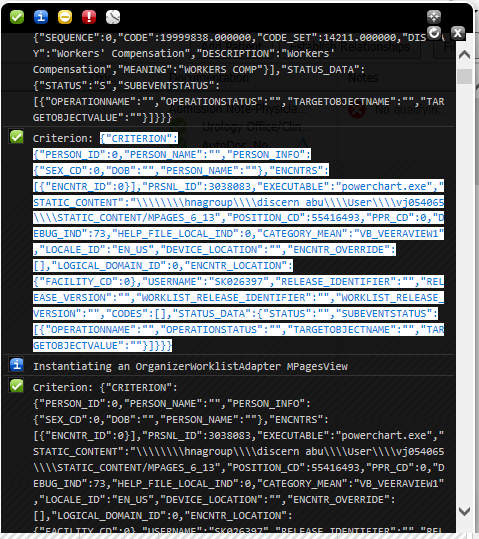

# Gaia Live Development Plugin

The Gaia Live Development plugin uses the Cerner Millennium Proxy
plugin, Content Server plugin, and Webpack plugin to automatically log
into a domain and launch custom MPages views and components behind the
scenes.

To access the Gaia Live Development plugin in Gaia, click `Live Dev`
on the plugin list on the left.

## Configure the Driver Settings

The Driver section of the Live Development plugin allows you to
configure driver settings for the MPages view.

You can specify the following information when configuring the driver
settings:

-   **Static Content Location:** This is the root directory path for a
    local copy of the static content, which is standard code provided by
    MPages. This static content is usually located on a domain's code
    warehouse and is shipped on a package. The static content location
    path can be relative or absolute.

-   **CCL Program:** This is the CCL program that launches an _MPages_
    view. The CCL program may vary depending on which _MPages_ view you
    want to launch. For ViewBuilder _MPages_ views, the CCL program is
    `mp_unified_driver`. Specifically for Organizer MPage Views, the CCL program is `mp_unified_org_driver`

-   **Program Parameters:** These are the comma-separated parameters to
    be passed to the specified CCL program when launching the MPages
    view. String parameters can be delimited using standard CCL string
    delimeters: `^`, `~`, `'`, and `"`. You can click `Param Parser` to
    automatically populate the Program Parameters box with parameters
    compatible with the CCL program you choose i.e. either `mp_unified_driver` or `mp_unified_org_driver`.

-   **Web Service URL:** If you are using an MPages Web Service other
    than the Cerner Millennium Proxy plugin provided with Gaia, you can
    specify the service URL. The URL should include everything leading
    up to the `reports` section of the URL. For example, if the URL is
    `http://mydomain.com/discern/reports/mp_unified_driver?PARAMS...`,
    enter `http://mydomain.com/discern` in the Web Service URL box.

#### Driver settings for Chart level MPage View
Complete the following steps to configure the driver settings in the Live Development plugin:

1.  In the `Static Content Location` box, enter the root directory path
    for a local copy of the static content.

2.  In the `CCL Program` box, enter the CCL program that launches the
    MPages view.

3.  Click `Param Parser`. The Parameter Parser dialog box is
    displayed.

4.  Paste the appropriate information in the `Paste Page Source` box,
    depending on whether you can right-click within an MPages view in
    PowerChart:

    a. If you can right-click in the MPages view:

        i.  Open the MPages view in PowerChart.

        ii. Right-click anywhere in the view and select `View Source`.

        iii. Copy the entire MPages view source code.

        iv. Return to Gaia.

        v.  Click `Unified Driver` in the Parameter Parser dialog box.

        vi. Paste the MPages view source code in the Paste Page Source
            dialog box.

    b. If you cannot right-click on the MPages view:

        vii. Open Blackbird for the MPages view.

        viii. Copy the entire Criterion JSON string. (Refer image below)

        ix. Return to Gaia.

        x.  Click `Criterion JSON (Unified Driver)` in the Parameter Parser dialog box.

        xi. Paste the criterion JSON string in the Paste Page Source
            dialog box.

    

5.  Click `Generate`. The appropriate parameters are entered in the
    Program Parameters box.

6.  Click `Finish`. The Parameter Parser dialog box is closed.

#### Driver settings for Organizer level MPage View
1.  In the `Static Content Location` box, enter the root directory path for a local copy of the static content. This directory should contain both `MPAGES_x_x` and `MPAGES_WORKLISTS_x_x` static content folders.

2.  In the `CCL Program` box, enter the `mp_unified_org_driver` that launches the Organizer MPages view.

3.  Click `Param Parser`. The Parameter Parser dialog box is displayed.

4.  Paste the appropriate information in the `Paste Page Source` box, depending on whether you can right-click within an Organizer MPages view in PowerChart:
    
    a. If you can right-click in the Organizer MPages view:

        i.  Open the Organizer MPages view in PowerChart.

        ii. Right-click anywhere in the view and select `View Source`.

        iii. Copy the entire Organizer MPages view source code.

        iv. Return to Gaia.

        v.  Click `Unified Org Driver` in the Parameter Parser dialog box.

        vi. Paste the Organizer MPages view source code in the Paste Page Source dialog box.

    b. If you cannot right-click on the Organizer MPages view:

        vii. Open Blackbird for the Organizer MPages view.

        viii. Copy the entire Criterion JSON string. (Refer image below)

        ix. Return to Gaia.

        x.  Click `Criterion JSON (Unified Org Driver)` in the Parameter Parser dialog box.

        xi. Paste the criterion JSON string in the Paste Page Source dialog box.

    
    
5.  Click `Generate`. The appropriate parameters are entered in the
        Program Parameters box.
    
6.  Click `Finish`. The Parameter Parser dialog box is closed.

7. In the `Program Parameters` box you will observe that the path to the static content is `^$STATIC_CONTENT$|MPAGES_xx|MPAGES_WORKLISTS_xx^`. Replace `MPAGES_xx` with the folder name containing MPAGES_x_x content and replace `MPAGES_WORKLISTS_xx` with the folder name containing MPAGES_WORKLISTS_x_x content.

## Configure the Artifact Settings

The Artifact section of the Live Development plugin allows you to
configure artifact location settings for the MPages view. You can either
use the existing Webpack plugin settings or enter hardcoded paths for
both the source and CSS locations.

You can specify the following information when configuring the artifact
settings:

-   **i18n Location:** This is the location for your artifact's
    compiled i18n file.

-   **Enable Webpack:** This setting allows you to specify whether your
    artifact is configured to use the Gaia Webpack plugin to build
    itself. If selected, Gaia automatically includes the generated
    Webpack bundle and ensures that the Webpack server is running prior
    to launching the MPages view. If you select this option, you must
    configure the Webpack targets using the Webpack plugin.

-   **Enable Auto-Refresh:** This setting allows you to specify whether
    you want the page to automatically refresh every time Webpack
    recompiles the code. To use this feature, you must also select the
    Enable Webpack check box.

-   **Webpack Target:** This is the Webpack target to be run when
    generating the Webpack bundle. If you select the Enable
    Webpack check box and there is more than one Webpack target, this
    setting becomes a list from which you can select the correct Webpack
    target.

-   **Source Code Location:** This is the full or relative path for the
    source code to be injected into the MPages view. The path is only
    required if you are **not using the Webpack** to build your artifact.

-   **CSS Location:** This is the full or relative path for the CSS file
    to be injected into the MPages view. The path is only required if
    you are **not using the Webpack** to build your artifact.

Complete the following steps to configure the artifact settings in the
Live Development plugin:

1.  In the `i18n` box, enter the path for your artifact's i18n file.

2.  Select `Enable Webpack` if your artifact uses the Gaia Webpack
    plugin to build itself. If your artifact does not use the Gaia
    Webpack plugin, skip to Step 5.

3.  Select `Enable Auto-Refresh` if you want the page to automatically
    refresh when the Webpack recompiles the code.

4.  If more than one Webpack target is available, select the target you
    want from the Webpack Target list.

5.  If you did not select `Enable Webpack`, enter the full or relative
    path for the source code to be injected into the MPages view.

6.  If you did not select `Enable Webpack`, enter the full or relative
    path for the .CSS file to be injected into the MPages view.

## Configure the Data Retrieval Settings

The Data Retrieval Settings section of the Live Development plugin
allows you to configure Gaia to use Bedrock mocks when launching your
artifacts.

Complete the following steps to configure the Bedrock mocks and data
retrieval settings in the Live Development plugin:

1.  In a logical location near your existing Bedrock mocks folder, add a
    folder called `bedrockMocks`.

2.  Create an empty .JS file in the newly-created `bedrockMocks` folder.

3.  Ensure that your component is on the first tab in the ViewPoint, and
    click `Launch` to launch the view.

4.  Right-click on the MPages view and select `View Page Source`.

5.  In the page source window, search for `var m_mpageSettingsJSON`
    and copy the entire variable string, from `var` to the semicolon
    after `STATUS_DATA` object.

6.  Paste the variable into the .JS file created in Step 2. This
    variable should contain settings for your component. If it does not,
    ensure that your component is on the first tab in the ViewPoint and
    refresh the view or launch the view again.

7.  Right-click on the MPages view and select `View Page Source`.

8.  In the page source window, search for `var m_viewpointJSON` and copy
    the entire variable string. This variable contains settings for the
    view and ViewPoint.

9.  Save the .JS file and copy the path to your file, including the file
    name. You can use either the full or relative path.

10. In the Live Development plugin, select `Enable Bedrock Mocks`.

11. In the Bedrock Mocks Location box, paste the file path for your .JS
    file, including the file name.

12. Click `Save Configuration`. This loads your bedrockMocks folder
    into the Content Server plugin and loads the files into the Injector
    plugin.

13. Click `Launch`, or refresh the view if you have already launched
    it.

The new Bedrock mock files are now used. You can now make changes to
your Bedrock variables and refresh the view to see the changes.

Complete the following steps to record mock data using the Record plugin:

1. Click **Launch** in the Launch Pad section of the Live Development plugin.

2. Enter the collection name. This activates the Record button.

3. Click **Record** once to save the mock data.

## Launch Pad

The Launch Pad section of the Live Development plugin allows you to
launch your MPages view. The following features are available in this
section:

-   **Launch URL:** Expand `Launch URL` to view the exact URL that is
    launched when you click the `Launch` button. The URL is
    automatically generated based on how you configured the other
    options in the Live Development plugin configuration.

-   **Save Configuration:** When you click `Save Configuration`, Gaia
    applies all the configuration settings to the respective plugins and
    updates the gaia.json file.

-   **Launch:** When you click `Launch`, Gaia saves the configuration
    and displays a login window where you enter your Cerner Millennium
    credentials. Once you enter the credentials, Gaia launches the
    MPages view based on your configuration settings. If the view does
    not open, enable pop-ups in your browser.
