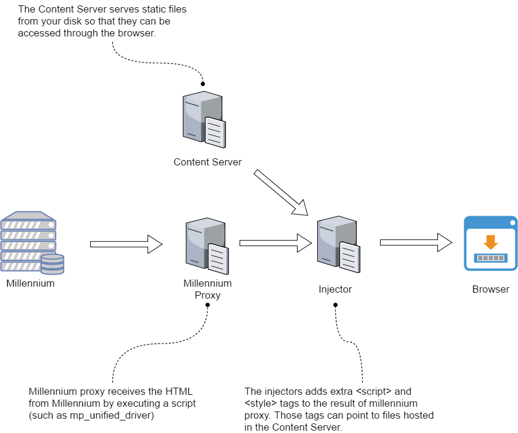
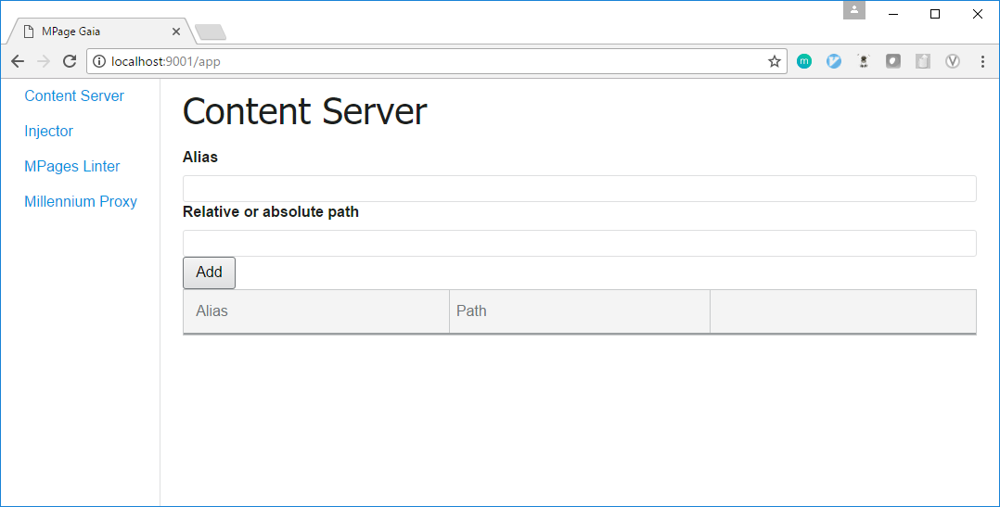
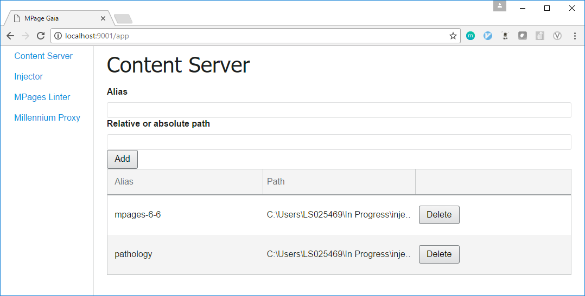
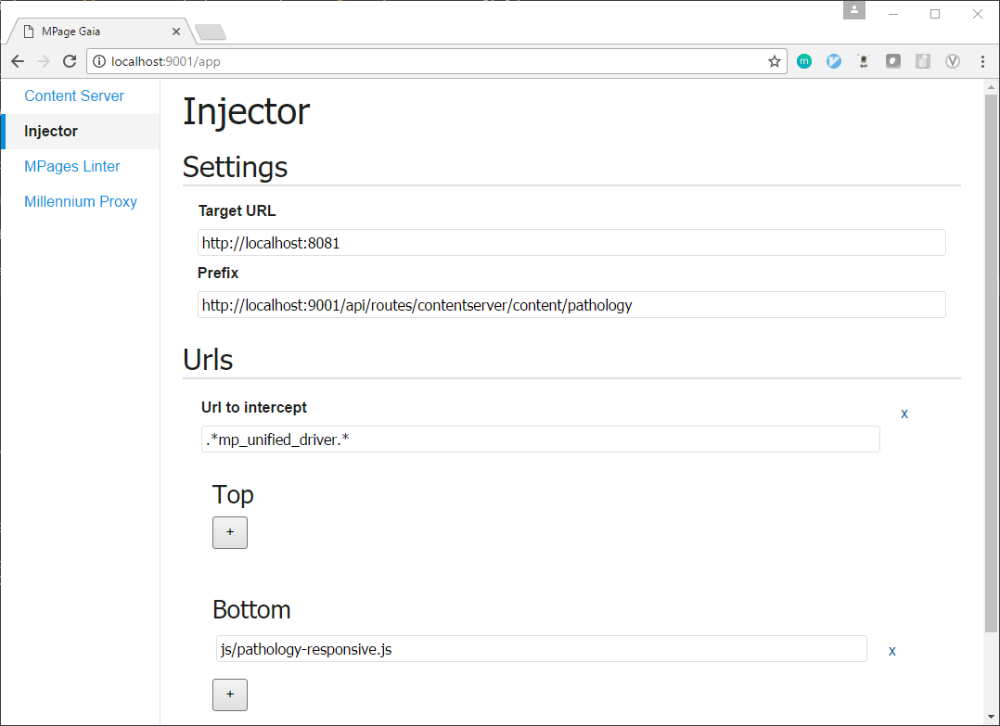
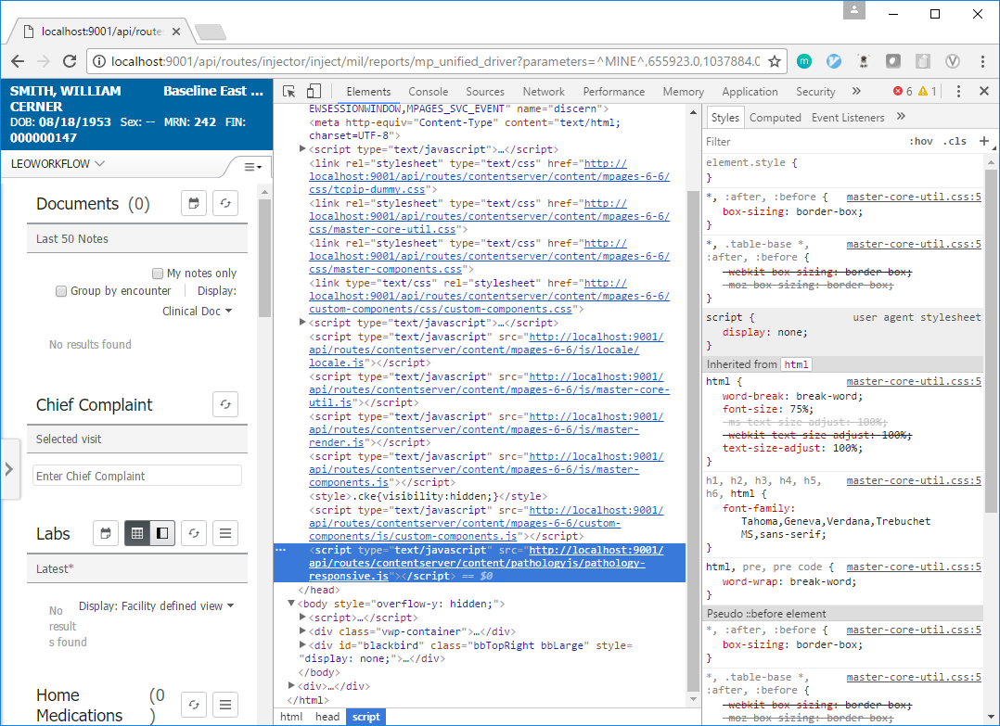
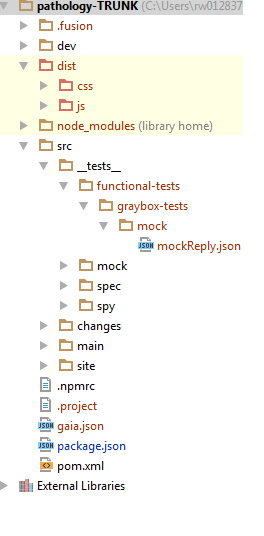

# Gaia Injector Plugin

The injector aids MPage development by allowing custom code to be injected into any HTTP millennium call. This allows JavaScript and CSS to be loaded into an MPage without the need to edit or rebuild any static_content files.

## How does it work

The *injector* works in tandem with the *Content Server* and *Millennium Proxy* gaia plugins. Each has a different purpose:

* *Content Server*: serves files from the hard drive through an HTTP server.
* *Millennium Proxy*: connects to a Millennium domain to execute CCL scripts.
* *Injector*: reads HTTP requests from a target, and injects specified `<script>` and `<style>` tags as specified in its configuration.


Here is how they work together:




The files pointed by `<script>` and `<style>` tags are set in the injector configuration. They are usually served by the *Content Server*, but don't have to be.

Because the *Injector*, *Content Server*, and *Millennium Proxy* are all separate Gaia plugins, a varied number of configurations can be created that match a particular artifact's workflow.

## Tutorial

This tutorial will go through the process of setting up the *Pathology* fusion component to use the *Injector*. This is a standard workflow for most of fusion components, but can be adapted to be used in other artifacts, such as worklist and legacy components.

The steps are:

1. Install gaia and download the pathology artifact
1. Download a static content and remove pathology from it
1. Setup the content server
1. Setup the injector
1. Log into a domain through millennium proxy
1. Open the browser

### Install Gaia and download the pathology artifact

Make sure you have at minimum Java 1.8 and Git installed.

Install Gaia by executing the commands:

```
npm config set registry "http://repo.release.cerner.corp/npm"
npm install -g git+https://github.cerner.com/MPagesEcosystem/mpage-gaia.git
```

This will give you a `gaia` command on the terminal.

Then checkout the *pathology* component from this location (with SVN):

http://scm.discern-abu.cerner.corp/svn/com.cerner.discernabu.component/trunk/pathology

### Download static content

We will need a static content to load the `pathology` component. For this example, we will checkout MPages 6.6 from SVN:

`http://scm.discern-abu.cerner.corp/svn/com.cerner.discernabu.assembly/trunk/mpages-6-6`

Because `mpages-6-6` already contains `pathology` code, we will need to remove it. Otherwise we will have *two* pathologies after injecting our development version.

Open `mpages-6-6` `pom.xml`, and remove the `pathology` artifact from the dependencies. That would be anything matching those lines (version will vary):

```
<dependency>
    <groupId>com.cerner.discernabu.component</groupId>
    <artifactId>pathology</artifactId>
    <version>1.0.3</version>
    <scope>compile</scope>
</dependency>
```

Finally, build your copy of `mpages-6-6` without pathology by executing the following in the root of `mpages-6-6`:

`mvn clean package`

### Build the pathology artifact

In the root of the `pathology` artifact, execute:

`npm install`

followed by:

`npm run build`

It will create a `pathology-responsive.js` in the `dist` folder for `pathology`. Remember the path to this folder, as we will use in the next section.

It is also possible to auto rebuild these files every time a source file changes, but that is out of the scope for this tutorial.

### Setup the content server

We will now start the gaia server and setup the content server to serve both the static content we downloaded and the component javascript file.

Open a command line and run:

`npm run gaia server`

Then navigate to

http://localhost:9001/app

Select the content server tab, and you shall be greeted with this:



The content server will serve a folder specified in the **Relative or absolute path** using the provided **alias**. So if you have:

* Alias: fooalias
* Path: c:\foo

and there is a file `c:\foo\foo.txt`, you can go to:

http://localhost:9001/api/routes/contentserver/content/fooalias/foo.txt

and the file will be served.

Create an alias for both the `compressed-resources` in the `mpages-6-6` artifact, and the `dist` folder in `pathology`. In my case, those turned out to be:

* Alias: mpages-6-6
* Path: C:\Users\LS025469\In Progress\injector\tutorial\mpages-6-6\target\compressed-resources

and

* Alias: pathology
* Path: C:\Users\LS025469\In Progress\injector\tutorial\pathology\dist

The final setup looks like:



You can test it by accessing the `master-core-util.js`:

http://localhost:9001/api/routes/contentserver/content/mpages-6-6/js/master-core-util.js

and the `pathology-responsive.js`:

http://localhost:9001/api/routes/contentserver/content/pathology/js/pathology-responsive.js

These paths can also be relative. Relative paths are relative to where you fired the `gaia` command.

### Start millennium proxy

To call `mp_unified_driver` we need to connect to a millennium domain.

Go to the **Millennium Proxy** tab on the web interface and click the  **start** button. That will start the millennium server on **http://localhost:8081**.

Then fill in a **User**, **Password**, and **Domain** for a millennium account, and click **Login**. Wait until the login succeeds.

If you are curious, you can test that the connection works by calling `mp_unified_driver` suffixed with `/mil/reports` and valid `mp_unified_driver` parameters.

Example (that might not work if the domain has refreshed recently):

`http://localhost:8081/mil/reports/mp_unified_driver?parameters=^MINE^,655923.0,1037884.0,2882005.0,441.0,1119.0,^powerchart.exe^,^^,^LEOVIEWPOINT^,9`

Because millennium proxy is a java service, it is the only one that doesn't run through Gaia's built in server. All the other plugins will run through http://localhost:9001/api/routes.

### Setup the injector files

Since we will be hitting the `mp_unified_driver` CCL script to generate the HTML, we need to tell the injector to inject `pathology-responsive.js` into it.

Go to the **Injector** tab in the gaia web app.

Set the target URL to be the URL we will use for millennium proxy. In this case, it's simply

http://localhost:8081

Click on **Add URL**, and then set the **Url to intercept** field as:

`.*mp_unified_driver.*`

Note how it can take regular expressions: regexes allows us to be flexible on how to match the requests we want to inject.

Now click on the **plus add (+)** for the **bottom** section. This will tell the injector that we will want to inject a file at the bottom of the `<head>` tag of `mp_unified_driver`.

Set the file to:

`http://localhost:9001/api/routes/contentserver/content/pathology/js/pathology-responsive.js`

and the injector is ready to go.

The final configuration should look similar to this:



### How about CSS?

If you add a file with extension `.css`, the injector will know to add a `<style>` tag instead of a `<script>` one.


### Fire up the browser!

Finally, all you need now is to call the injector. You just need to prefix a regular `mp_unified_driver` call with:

`http://localhost:9001/api/routes/injector/inject/mil/reports`

and point the static content location to the content server.

Example:

http://localhost:9001/api/routes/injector/inject/mil/reports/mp_unified_driver?parameters=^MINE^,655923.0,1037884.0,2882005.0,441.0,1119.0,^powerchart.exe^,^http://localhost:9001/api/routes/contentserver/content/mpages-6-6^,^LEOVIEWPOINT^,9

Then, if you look at the source code of the page, you will notice that the component file is being injected:



Note how everything after `injector/inject` will be forward as is to the **target** server, as specified in the injector. This allows the injector to be used with any server, not just millennium proxy.

### Gaia.json

All gaia settings are automatically saved in the `gaia.json` file in the directory where `gaia` was executed. You can store this file to easily load the same configuration accross different artifacts.

### Mocked CCL Responses

With the use of the injector it is possible to return mocked xmlCCLRequest calls.  To leverage response mocking the following configuration will need to be created:

1. Add/Modify a mockReply.json file to the working directory that contains a collection of mocked request responses.

  

  Need some inspiration for responses?  [Sample mocks.json file](./docs/MocksSample.json)

1. Add/Modify mockResponses properties in the gaia.json file.

	** Example of a mockResponses object below in the injector settings.

	```javascript
	"injector": {
        "settings": {
            "targetUrl": "http://localhost:8081",
            "prefix": "http://localhost:9001/api/routes/contentserver/content/pathology-trunk"
        },
        "urls": {
            ".*mp_unified_driver.*": {
                "top": [],
                "bottom": [
                    "/dist/js/pathology-responsive.js",
                    "/src/__tests__/functional-tests/graybox-tests/mock/mockReply.js"
                ]
            }
        },
        "mockResponses":{
            "mockResponseLocation":"./src/__tests__/functional-tests/graybox-tests/mock/mockReply.json",
            "mockCollectionName":"smallData"
        }
    }
	```

1. The mockResponseLocation property is either the relative or full path to the location of the json file(s) containing the mocked responses.

1. The mockCollectionName property is the key to the collection of mock responses.

1. The json file is capable of containing many test collections and each collection can have one or more responses.

1. At this point every request that runs through the injector is inspected against the mockReply.json file and the collection specified in the gaia settings.  If a match is found based on the request (script name) the mocked reply is used instead. For more details, check the [guide](docs/ui-guide.md).