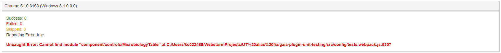
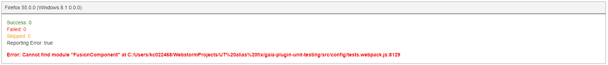
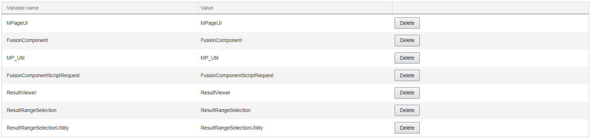

# Gaia JS Unit Testing Plugin

The JS Unit Testing plugin uses Karma, Webpack, and Jasmine to run unit
tests in your artifact against your JavaScript files.

1.  **Configure JS Unit Testing Settings**

The Config tab allows you to configure settings for the JS Unit Testing
plugin. Once you save the settings, your tests run and the output is
displayed in the Test Output tab.

The following settings are available in the Config tab of the Unit
Testing plugin:

-   **Single Run:** Select this option to configure Karma to capture
    browsers, run tests and exit. If unselected, Karma remains running
    and watches your files. Any changes to test or code files will cause
    your tests to rerun. Once you are done viewing the results,
    you can go to the cmd line and use CTRL+C to stop the Karma and Gaia servers.

-   **Browsers:** Select which browsers you would like to run the unit
    tests. Ensure that the selected browsers are installed on your
    device.

-   **Paths:** These boxes allow you to specify the paths where you want
    the unit tests to run. You must enter the source path and spec path,
    but the mock path and spy path are optional. You only need to enter
    the path down to a level where all remaining levels below contain
    the files you want. Enter the paths using the following format:
    `src/tests/unit-tests/spec`.

-   **My Artifact Uses Fusion:** Select this option if you want Karma to
    use MPages Fusion settings. Fusion is not supported by Gaia at this
    time.

-   **Webpack Externals:** If your artifact uses externals, select the
    target you configured from the list. The target is configured in the
    Webpack plugin. If the list does not display the target, refresh the
    page and try selecting the target again.

## Change Configuration Settings from Command Line

It is recommended that you complete the initial configuration setup
using the Gaia UI. Once your initial configuration is complete, it is
easy to change small configuration items from the command line.

When sending settings from command line, you must use escaped quotes for
your keys, and you must also use escaped brackets if you are sending
more than one setting. The following examples display correctly escaped
settings:

`npm run gaia unit-testing:saveConfig settings={\"singleRun\":false}`

`npm run gaia unit-testing:saveConfig settings=\{\"singleRun\":false,\"usesFusion\":true\}`

## Run Unit Tests

The Test Output tab in the JS Unit Testing plugin allows you to run your
unit tests according to your configuration specified in the Config tab
of the JS Unit Testing plugin. When you first access the JS Unit Testing
plugin, the Test Output tab displays only the `Run My Unit Tests`
button. Click `Run My Unit Tests`. If the tests fail, adjust your
configuration settings and attempt to run the unit tests again.

Once the tests are run successfully, a panel is displayed for each
browser with a summary of test counts and a list of which errors
occurred for each browser. Each browser may return different errors, so
ensure that you review the summary from each browser. Output is also
displayed in the command prompt window. If you are running the unit
tests for more than one browser, results are totaled together. Unit test
results are saved in .JSON, .HTML, and code coverage output files in
your artifact's top-level directory in the following location:
`evidence\unit-tests`. You can zip this folder and use it for white
box evidence.

## View Code Coverage

The Code Coverage tab in the JS Unit Testing plugin displays the code
coverage report output by Karma after you run your unit tests. The
report is automatically updated each time you run the unit tests. The
Code Coverage tab displays the files from the following location:
`.\evidence\unit-tests\.coverage\html`

## Troubleshoot Common JS Unit Testing Issues

Some common issues may occur when using the JS Unit Testing plugin. See the
following sections for information about resolving these issues.

### Component Alias Settings

`Error: Cannot find module "[component path]" at [location]`

**Example:**

**Reason:** Component alias settings were used for the Webpack plugin.

**Resolution:** Use actual paths for what you want to import into the
file and remove the component alias.

### Webpack Externals

`Error: Cannot find module "FusionComponent" at [location]`

**Example:**

**Reason:** An external dependency is not found and you may need to set
your Webpack externals.

**Resolution:** Set your external modules in a Webpack target and set
that target in the Externals section of the Gaia Webpack plugin.

Complete the following steps to configure an external module:

1.  In the Externals section in the Webpack plugin, enter a name in the
    Variable Name box and a value in the Value box and click `Add`.
    The added external module is displayed on the table as displayed in
    the following example:

    

2.  Repeat Step 1 for each additional external module you want to add.

3.  Refresh the Webpack plugin.

4.  Return to the Config tab in the JS Unit Testing plugin.

5.  Select your new target and click `Save Changes`.
