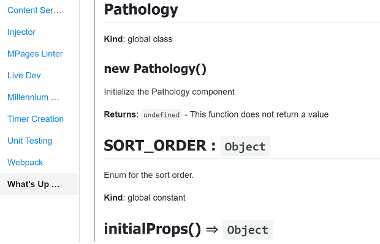
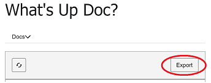

# Usage
## Gaia App Tab

### Quick start
To see the UI verson of `whats-up-doc`:
1. Run the gaia server: `npm run gaia server`, and then
2. Open gaia in the browser (e.g. `http://localhost:9001/app`)
3. Click on the "What's up Doc?" tab


Once Whats-up-doc is configured the jsDoc for the source code will be read.  For example:

```
/**
 * Initialize the Pathology component
 * @class Pathology
 * @returns {undefined} This function does not return a value
 */
export default class Pathology extends FusionComponent {
    constructor() {
        super("pathology");
        this.setComponentLoadTimerName("USR:MPG.PATHOLOGY.O2 - load component");
        this.setComponentRenderTimerName("ENG:MPG.PATHOLOGY.O2 - render component");
        this.setIncludeLineNumber(true);
        this.setPregnancyLookbackInd(true);
    }

    // ...
}
```

Will be rendered as:



### Exporting

Remember click the "Export" button to export the markdown to a file to share and/or document your awesomeness!


